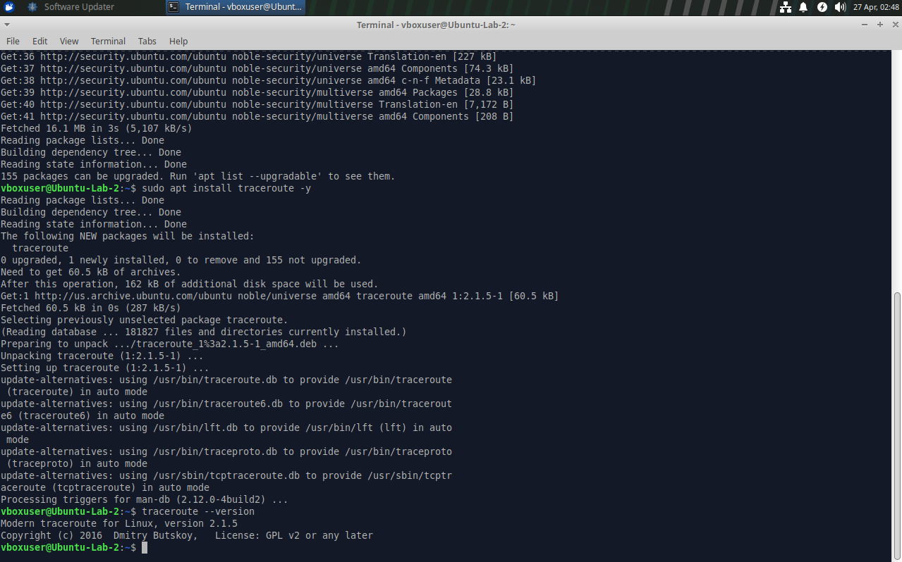
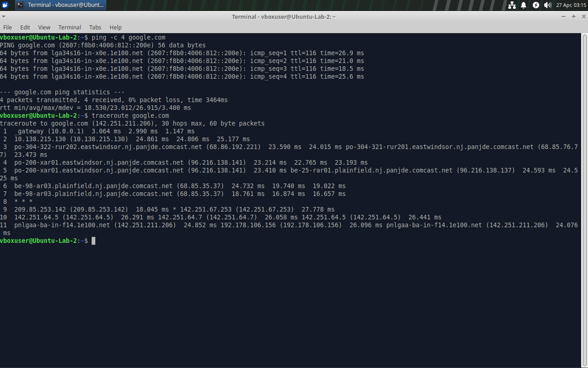
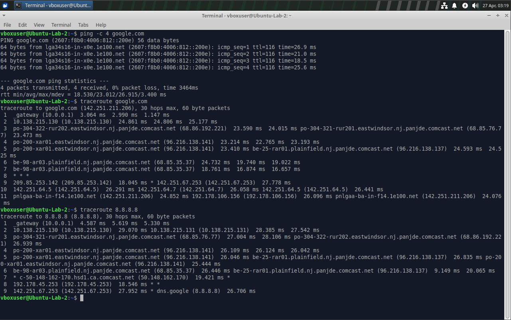
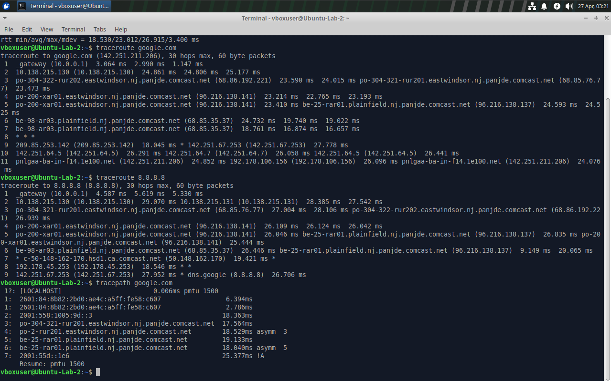

# Linux Network Tracing Lab

## Objective
Analyze how traffic travels across networks and identify where latency or routing changes occur using traceroute and tracepath.

---

## Lab Overview
In this lab, I examined how data moves from my system to external services. I compared routing paths using both domain names and direct IP addresses to understand how network behavior can vary.

## Screenshots

### Step 1: Install traceroute


### Step 2: Traceroute to domain


### Step 3: Traceroute to IP


### Step 4: Tracepath output

---

## Tools Used
- Ubuntu (Virtual Machine)
- traceroute
- tracepath
- ping

---

## Steps Performed

### 1. Installed traceroute
```bash
sudo apt update
sudo apt install traceroute -y
